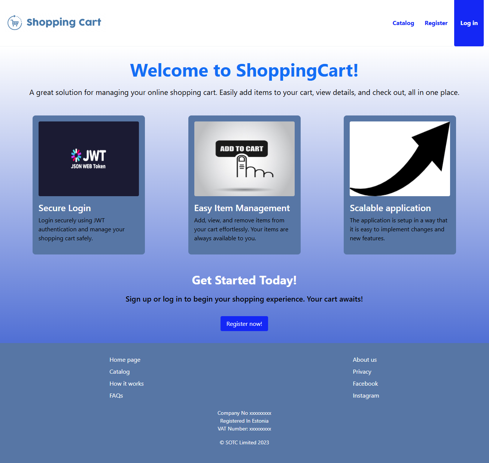
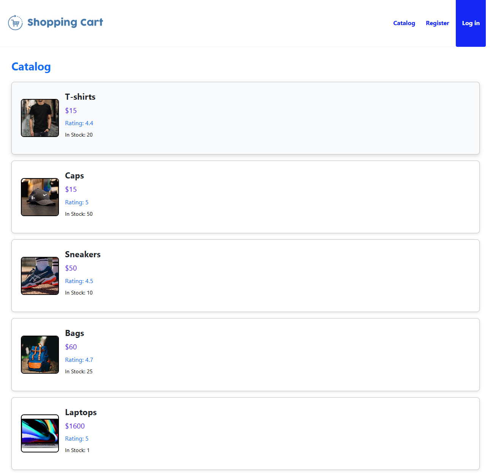
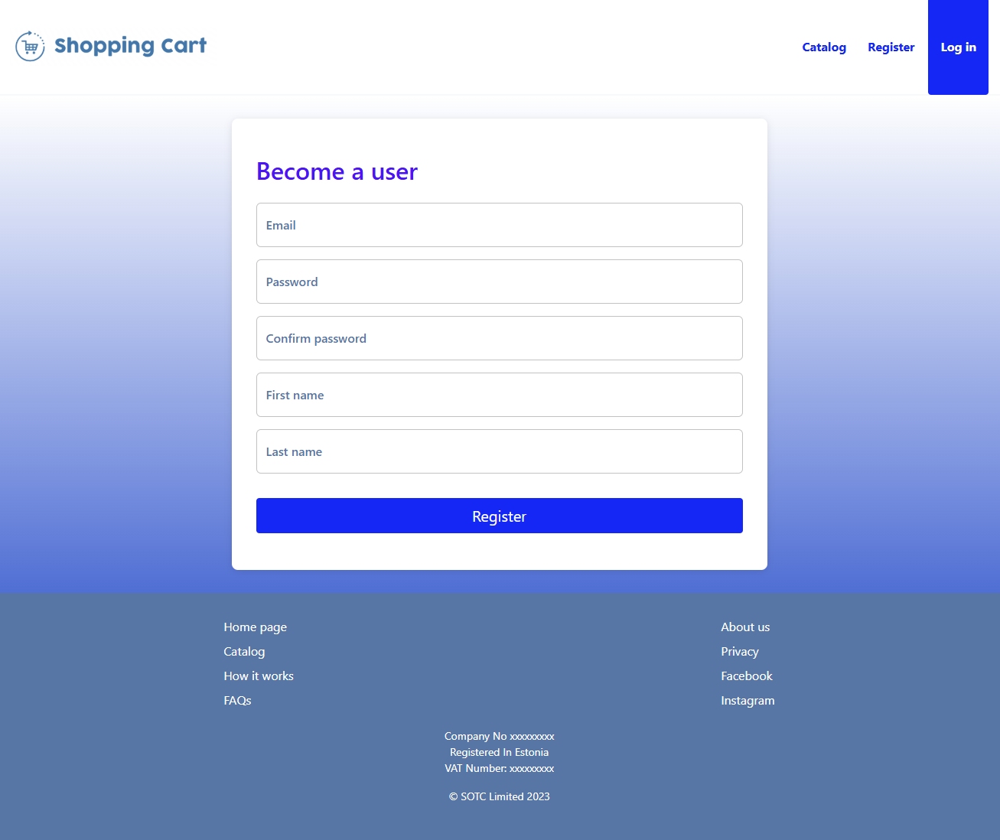
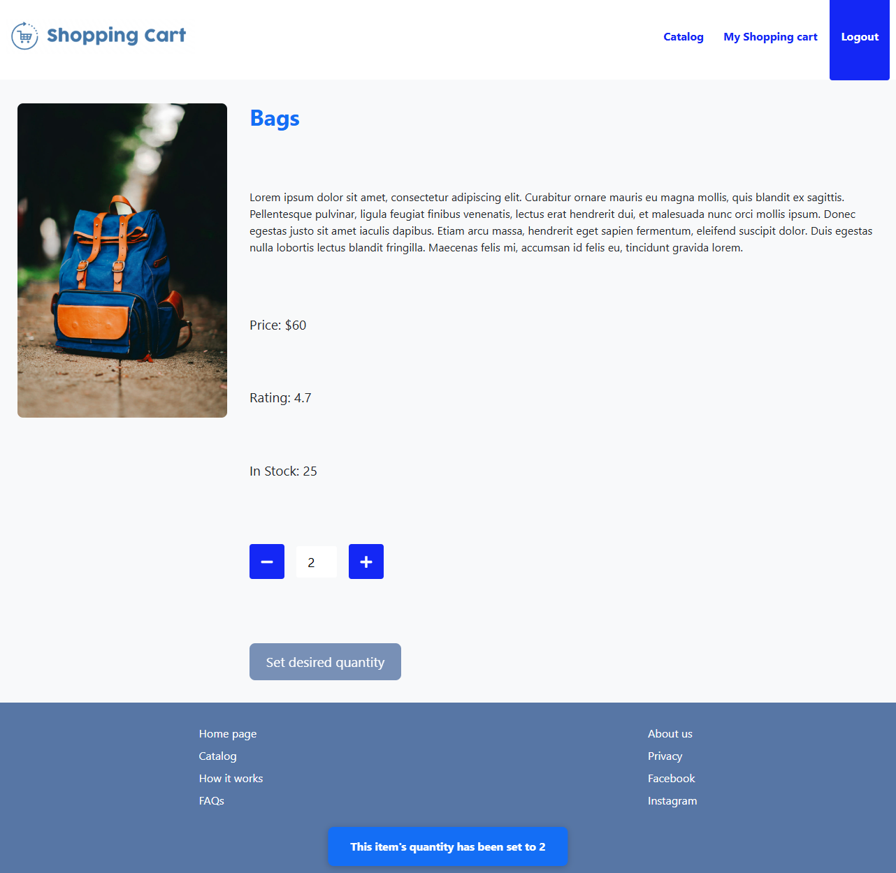
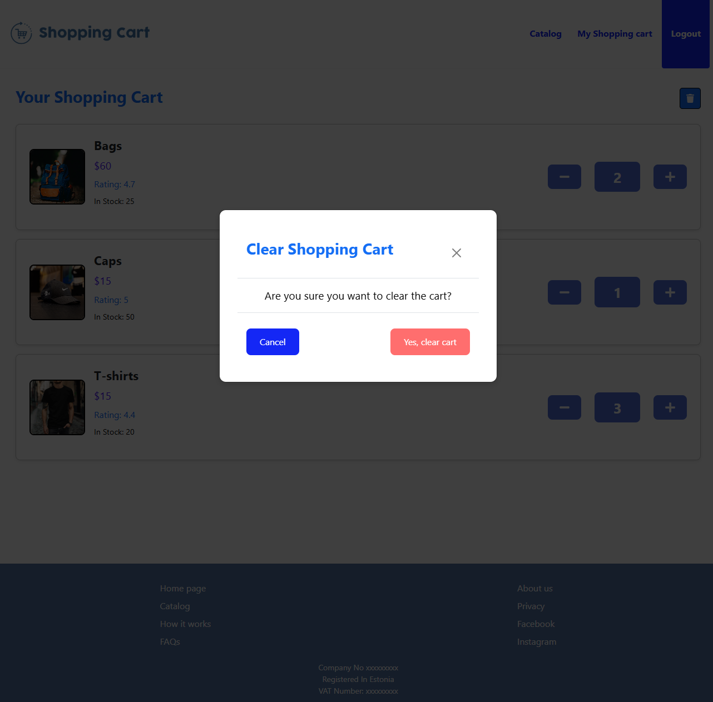

# ShoppingCart - Frontend

## About the Project

This is the frontend companion to my [**ShoppingCart Backend**](https://github.com/MadridBabajev/ShoppingCart-Backend) project, built as part of the recruitment process.

The frontend is a **React** single-page application that provides a clean, responsive interface for browsing products and managing a shopping cart. It communicates with the backend API to handle authentication and shop item operations.

Like the backend, this project was using [**MentorMe Frontend**](https://github.com/MadridBabajev/MentorMe-Frontend) as a template, but is ultimately built more care and attention to detail. Together they helped me secure my first position as a **Full-Stack Developer**.

---

## Technologies Used

- **React**
- **TypeScript**
- **SCSS**
- **Bootstrap**
- **Axios**
- **React Router**
- **JWT Authentication**
- **Docker & Docker Compose**
- **Nginx**

---

## Running the Project

### Prerequisites

1. **Install Node 24 and npm**  
   Download: https://nodejs.org/en/download/package-manager

2. **Verify installation:**
   ```bash
   node --version
   npm --version
   ```

3. **Install Docker Desktop**  
   Make sure Docker is running on your machine.

### Quick Start with Docker

The easiest way to run the project:

```bash
docker-compose up --build
```

The application will be available at `http://localhost:8080`.

### Local Setup

If you prefer running outside Docker:

1. **Install dependencies:**
   ```bash
   npm install
   ```
   
2. **Clean-build the project:**
   ```bash
   npm run build
   ```

3. Ensure that the [**ShoppingCart Backend**](https://github.com/MadridBabajev/ShoppingCart-Backend) is running locally at `http://localhost:8000`.

4. **Start the development server:**
   ```bash
   npm start
   ```

The React application will run at `http://localhost:3000`.

---

## Application Snippets

**Application's home screen:**



**Item catalog:**



**Registration form:**



**Item details:**



**Clearing selected items:**



---

## Related

- [**ShoppingCart Backend**](https://github.com/MadridBabajev/ShoppingCart-Backend)

---

_Madrid Babajev (02.02.2026)_
